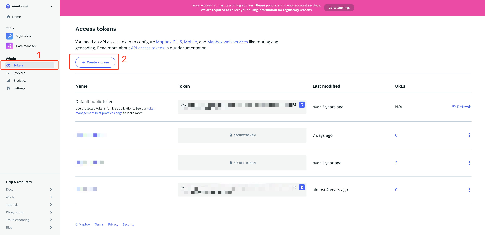
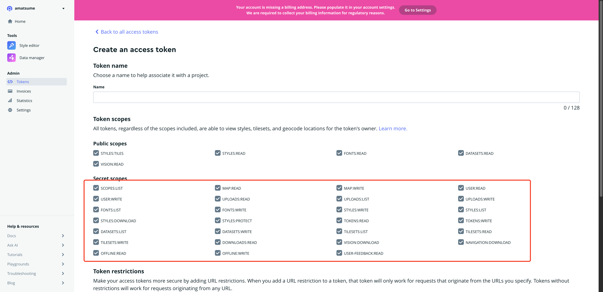
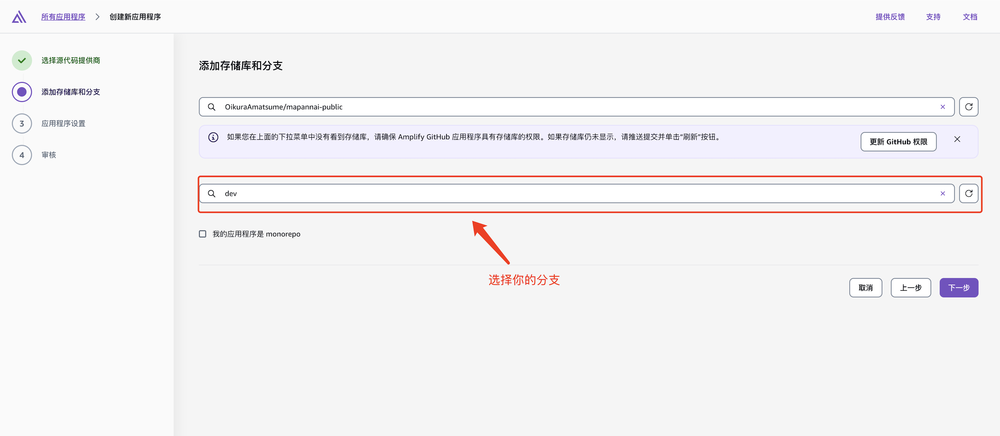
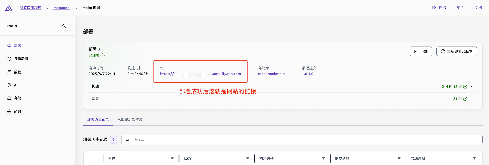
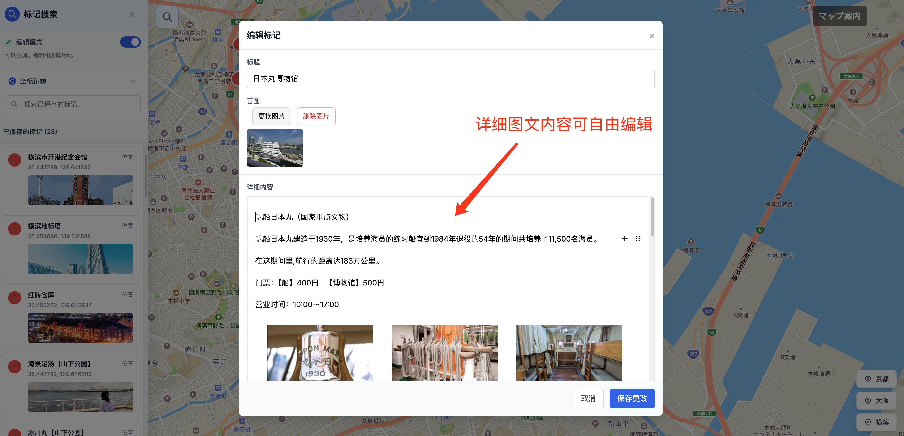
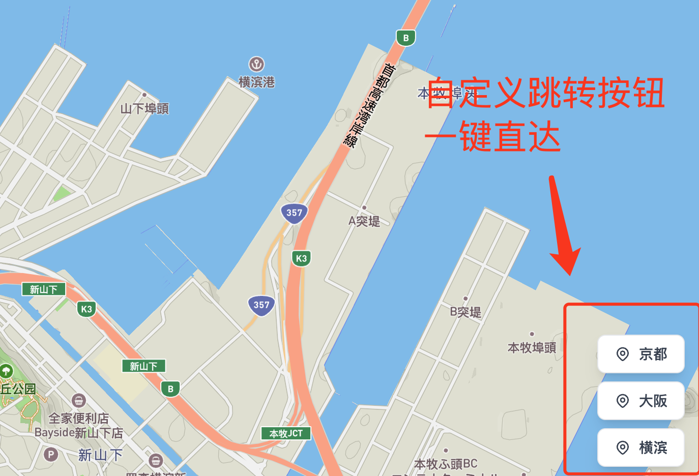

# マップ案内 (MapAnNai) - 交互式地图编辑器

一个基于Next.js和Mapbox的交互式地图标记编辑平台，支持富文本内容编辑、坐标跳转、标记分类等功能。

## 🚀 快速开始

### 1. Mapbox 配置申请

#### 1.1 创建 Mapbox 账户
1. 访问 [Mapbox官网](https://www.mapbox.com/)
2. 注册新账户或登录现有账户
3. 进入 [Account页面](https://account.mapbox.com/)

#### 1.2 获取 Access Token
1. 在 Account 页面找到 "Access tokens" 部分
2. 创建新的密钥


全部勾选，点击Create token按钮
3. 编辑 `src/lib/config.ts` 文件：


#### 1.3 创建 Dataset（可选）
1. 访问 [Mapbox Datasets](https://studio.mapbox.com/datasets/)
2. 点击 "New dataset"
3. 选择 "Empty dataset"
4. 记录下 Dataset ID

### 2. AWS S3 配置

#### 2.1 创建 S3 存储桶
1. 登录 [AWS Console](https://console.aws.amazon.com/)
2. 进入 S3 服务
3. 创建新的存储桶，名称如：`mapannai`
4. 配置存储桶权限（允许公共读取）

#### 2.2 创建 IAM 用户
1. 进入 IAM 服务
2. 创建新用户，如：`mapannai-s3-user`
3. 附加 `AmazonS3FullAccess` 策略
4. 创建 Access Key 和 Secret Key

#### 2.3 编辑 `next.config.js` 文件：
将domains修改为自己的 S3 域名

```typescript
images: {
    domains: ['mapannai.s3.ap-northeast-1.amazonaws.com'],
},
```

### 3. 添加城市配置
在 `cities` 配置中添加您需要的城市：

```typescript
cities: {
    // 现有城市...
    yourCity: {
        name: '您的城市名',
        coordinates: { longitude: 经度, latitude: 纬度 },
        zoom: 缩放级别
    },
}
```

## 🚀 部署到 AWS Amplify

#### 创建 Amplify 应用
登录 [AWS Amplify Console](https://console.aws.amazon.com/amplify/)






## 🎯 功能详情






#### 1. 标记分类
- **活动** 🎯：活动和娱乐场所
- **位置** 📍：一般地点标记
- **酒店** 🏨：住宿和酒店
- **购物** 🛍️：购物中心和商店

#### 2. 富文本编辑
- 支持标题、段落、列表
- 支持引用、图片
- 支持链接和格式化

#### 3. 数据同步
- 标记数据自动保存到 Mapbox Dataset
- 图片自动上传到 AWS S3
- 支持多人协作编辑


## 🤝 贡献指南

1. Fork 项目
2. 创建功能分支 (`git checkout -b feature/AmazingFeature`)
3. 提交更改 (`git commit -m 'Add some AmazingFeature'`)
4. 推送到分支 (`git push origin feature/AmazingFeature`)
5. 打开 Pull Request

## 📞 支持

如果您遇到问题或有建议，请：

1. 查看 [Issues](../../issues) 页面
2. 创建新的 Issue
3. 联系项目维护者

